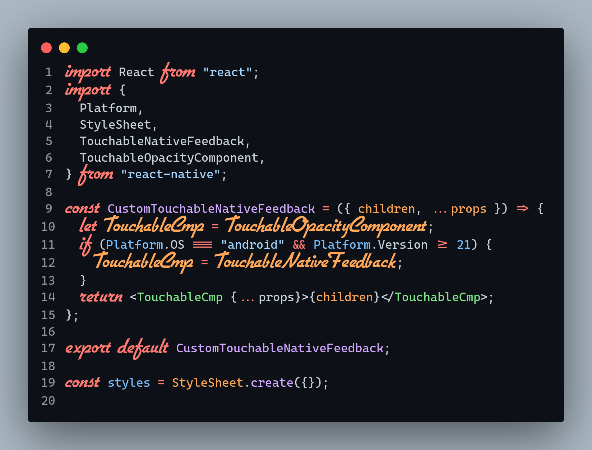

# CascaFlott

## A free Operator Mono-Alternative based on [Cascadia Code](https://github.com/microsoft/cascadia-code) and [FlottFlott](https://www.dafont.com/flottflott.font)

Font that combines Mono font from Cascadia Code including Font-Ligatures with FlottFlott as Italic font.
Tested with VSCode, but should support every Editor that supports italics.

### Installation Guide

1. Download **dist**
2. Install **ALL** TTF-Font-Files on your PC
3. Enable Italics in your Editor of Choice (also enable Font-Ligatures)

### VSCode specific

With the font installed, all italics will be written in the CascaFlott-Font. In your VSCode-Settings you can customize what
will be written in italics (and so in CascaFlott). The setting you need is called "editor.tokenColorCustomizations".

For example, my config looks like this:

```json
"editor.tokenColorCustomizations": {
    "textMateRules": [
      {
        "scope": [
          //following will be in italics (=FlottFlott)
          "comment",
          "entity.name.type.class", //class names
          "keyword", //import, export, return…
          //"support.class.builtin.js", //String, Number, Boolean…, this, super
          "storage.modifier", //static keyword
          "storage.type.class.js", //class keyword
          "storage.type.function.js", // function keyword
          "storage.type.js", // Variable declarations
          "keyword.control.import.js", // Imports
          "keyword.control.from.js", // From-Keyword
          //"entity.name.type.js", // new … Expression
          "keyword.control.flow.js", // await
          "keyword.control.conditional.js", // if
          "keyword.control.loop.js", // for
          "keyword.operator.new.js", // new
        ],
        "settings": {
          "fontStyle": "italic"
        }
      },
      {
        "scope": [
          //following will be excluded from italics has some defaults I don't want to be in italics)
          "invalid",
          "keyword.operator",
          "constant.numeric.css",
          "keyword.other.unit.px.css",
          "constant.numeric.decimal.js",
          "constant.numeric.json",
          "entity.name.type.class.js"
        ],
        "settings": {
          "fontStyle": ""
        }
      }
    ]
  }
```

### Screenshot



### Special thanks

Special thanks to [Simon Steindl](https://github.com/kosimst/) the creator of Firaflott for serving as inspiration.

### Thanks

- Firaflott – Combination of Fira Code and Pacifico for Italics – [github](https://github.com/kosimst/Firicico)

- Cascadia Code – OpenType code for the coding ligatures – [github](https://github.com/microsoft/cascadia-code)
- FlottFlott - flottflott is a trademark of P Wiegel - [dafont](https://www.dafont.com/flottflott.font)
